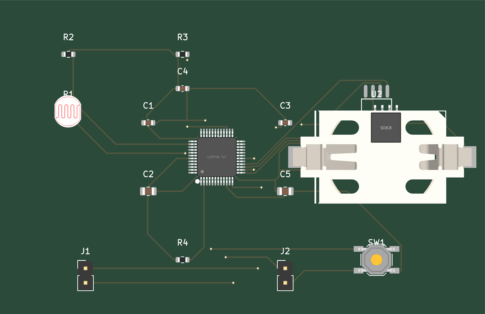
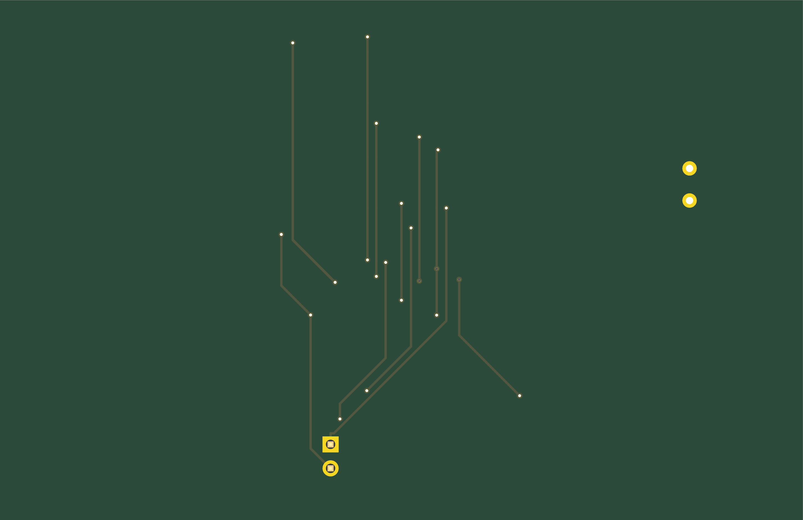
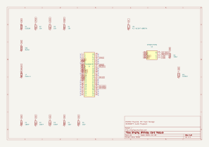
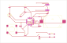

# KiCad Agent Experiment

An experiment to have Claude Code autonomously design and order PCBs from start to finish.

## Goal

Given project requirements (e.g., "make an ESP32 dev board with USB-C and 3 GPIO LEDs"), Claude Code should be able to:

1. Research and select appropriate components from JLCPCB's library
2. Design the schematic with proper connections
3. Create the PCB layout
4. Auto-route the traces
5. Run DRC/ERC checks
6. Generate fabrication files
7. Order the PCB via JLCPCB API

The human should only need to:
- Provide initial requirements
- Set up API keys
- Occasionally review/approve major decisions

## Status

**Setup Phase** - Installing tools and creating workflow documentation.

## Structure

```
singingcard/
├── kicad/              # KiCad project files
├── docs/               # Documentation and notes
├── venv/               # Python virtual environment
└── .claude/skills/     # Claude skill for KiCad workflow
```

## Tools

See `docs/tool-setup.md` for installed tools and configuration.

---

## Board Design

[](../../actions/workflows/export-images.yml)

<div align="center">
  <div>
    
    
    <p><em>3D Render</em></p>
  </div>
  <br>

  <div>
    <br>
    <p><em>Schematic</em></p>
  </div>
  <br>

  <div>
    
    <br>
    <em>PCB Layout</em>
  </div>
</div>
